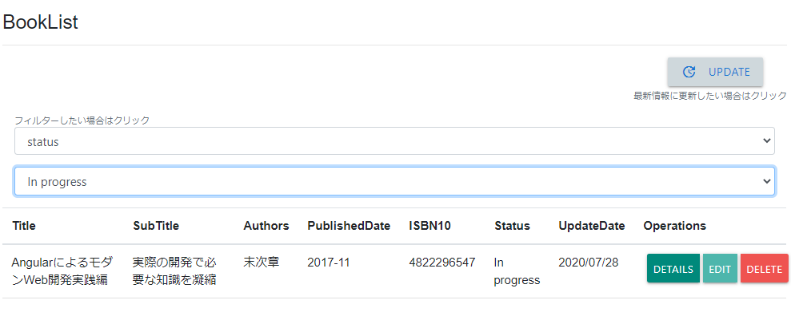
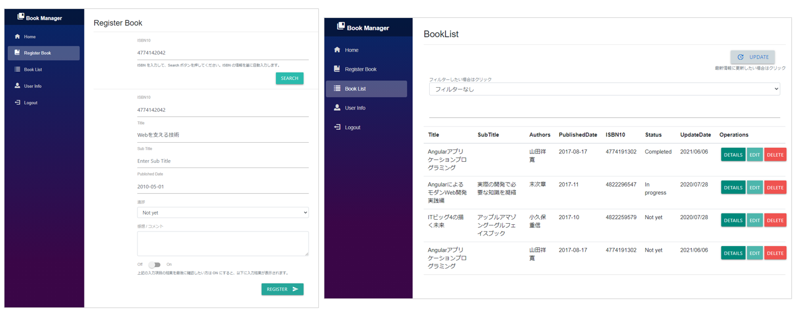
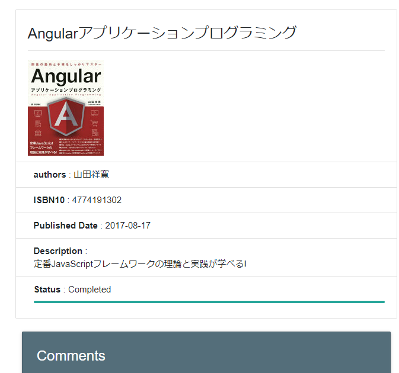

## 機能紹介
- Azure Active Directory や MS アカウントでログイン管理可能
- 書籍の登録に加え、感想等や 3 段階の進捗状況を登録可能
- Google Books Api を利用して ISBN からタイトルや詳細、書籍の画像等の自動補完が可能
- Title や進捗、ISBN によるフィルター機能付き (以下イメージ)

## 画面イメージ
- 書籍登録画面
- 書籍一覧画面
- 書籍詳細画面
- 書籍編集画面
- Login / Logout 画面 (AAD)

(以下一部画像抜粋)

