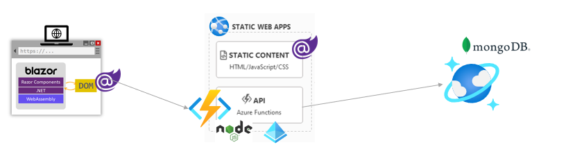

## Private Book Manager based on Blazor wasm
- Blazor WebAssembly 製のプライベート用 書籍管理アプリ (Private リポジトリで管理しているのでこちらは公開アーカイブ用)
- Blazor wasm と Static Web Apps 学習も兼ねて作成していた SPA + API (一部突貫工事気味...)
- バックエンドの API は Azure Static Web Apps の統合 Functions (FaaS) を利用した Node.js
- DB は Azure Cosmos DB を利用

## 環境詳細
### Production
- Host : Azure Static Web Apps
- CI/CD : GitHub Actions + Azure
- Frontend : Blazor WebAssembly (Blazor wasm)
- Backend : Integrated Azure Functions based on Node.js
- External API : Google Books Api
- Authentication : Auth integrations on Azure Static Web Apps (AAD)
- DB : Azure Cosmos DB MongoDB API (NoSQL)

### Development (Local)
- Host : dotnet.exe + Node.js (Functions)
- Frontend : Blazor WebAssembly
- Backend : Node.js + Azure Functions Core Tools
- External API : Google Books Api
- Authentication : json-server
- DB : Azure Cosmos DB Mongo DB API

## その他
簡単な機能紹介や画面イメージは [Details.md のページ](./DETAILS.md) へ

## ToDo
TBD (Issues に投稿予定)
